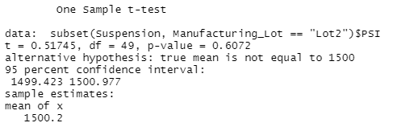

# MechaCar_Statistical_Analysis
Module 15

## Overview of Analysis

The MechaCar, AutosRUs’ newest prototype, is suffering from production troubles that are blocking the manufacturing team’s progress. AutosRUs’ upper management has called for a data analytics team to review the production data for insights that can help the manufacturing team.

## Resources:

Software:  
Rstudio 
 
Code:  
[MechaCarChallenge.R](MechaCarChallenge.R) 

Images: 
[images](images/)  

Data: 
[MechaCar_mpg.csv](data/MechaCar_mpg.csv) 
[Suspension_Coil.csv](data/Suspension_Coil.csv) 

## Linear Regression to Predict

 
Vehicle length and vehicle ground clearance are statistically likely to provide non-random amounts of variance to the model.  Vehicle weight, spoiler angle, and All Wheel Drive (AWD) have p-Values that indicate a random amount of variance within the dataset.

The p-Value for this model is 5.35e-11. That is smaller than the assumed significance level of 0.05%. This shows there is sufficient evidence to reject our null hypothesis, which indcates that the slope of this linear model is not zero.

This linear model has an r-squared value of 0.7149. This means that approximately 71% of all mpg predictions can be determined by this model. This multiple regression model does predict mpg of MechaCar prototypes effectively.

## Summary Statistics on Suspension Coils

The mean, median, variance, and standard deviation (SD) of the suspension coil’s PSI for all lots.

 

The mean, median, variance, and standard deviation (SD) of the suspension coil’s PSI for each individual lot.

 

When looking at the combined PSI variance of all production lots, the variance of the coils is 62.29 PSI, which is within the 100 PSI variance required by AutosRUs'.

Lot 1 and Lot 2 are within the 100 PSI variance requirement (Lot 1 has 0.98 and Lot 2 has 7.47).

Lot 3 has a variance of 170.29 and does not meet the 100 PSI variance required by AutosRUs' and inflates the total variance seen in the total summary of the combined lots.

## T-Tests on Suspension Coils

Below are t.tests to determine if the PSI across all manufacturing lots is statistically different.

All Lots 
 

Lot 1  
 

Lot 2 
 

Lot 3 
 

Across all lots:  

The true mean of the sample is 1498.78 and has a p-Value of 0.06, which is higher than the common significance level of 0.05, there is NOT enough evidence to support rejecting the null hypothesis.  The mean of all three of these manufacturing lots is statistically similar to the presumed population mean of 1500.

Individual lots: 

Lot 1 has the true mean of 1500 and has a p-Value of 1.  We cannot reject the null hypothesis that there is no statistical difference between the observed sample mean and the presumed population mean (1500).

Lot 2 has the true mean of 1500.02 and has a p-Value of 0.61.  We cannot reject the null hypothesis that there is no statistical difference between the observed sample mean and the presumed population mean (1500).

Lot 3 has the true mean of 1496.14 and has a  p-Value is 0.04.  That is lower than the common significance level of 0.05. All indicating to reject the null hypothesis that this sample mean and the presumed population mean are not statistically different.

## Study Design: MechaCar vs Competition

To design the MechaCar to "Best the Competition" we will need to compare many variables against all competing manufaturers.  See below for a list of variables. 

Collecting data for competition models across all manufacturers, from the last model upgrade:

Price 
MPG - City 
MPG - Highway 
Horsepower 
Maintenance 
Re-sale Value 

Null Hypothesis (Ho): MechaCar is priced correctly based on its performance of key factors against competition. 

Alternative Hypothesis (Ha): MechaCar is not priced correctly based on its performance of key factors against competition. 

Statistical Tests
I would collect the mean, median, variance, and standard deviation of the above mentioned variables.  I could collect them as a group and than across individual manufacturers.  After I would compare t.tests to compare the data against the MechaCar.